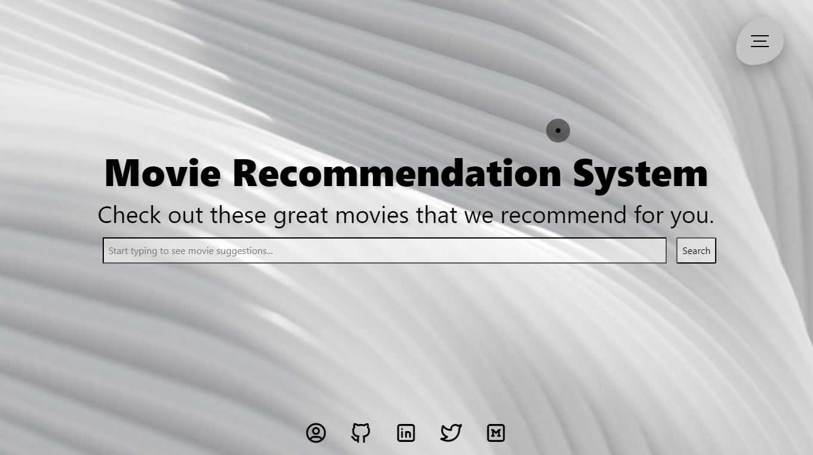
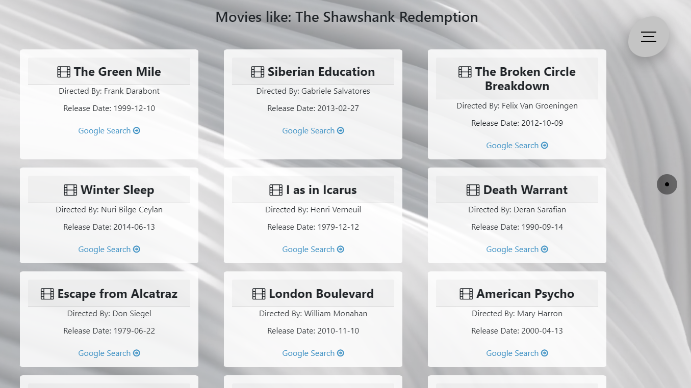

# Movie Recommendation System (MRS)

This repository contains all the project files and necessary details about applications required to run the project on your local machine as well as host it as a Django Application on your Server/Domain.

<hr>

## 1. Demo :movie_camera:

In this section, we try to understand around the project and what all can be achieved through it.

1. [Movie Recommendation System Hosted Application Demo]

2. [Running MRS on local System]

3. Sample Screenshots

   1. Home Screen

      

   2. Navigation Screen

      

   3. Search with Auto Suggestion

      

   4. Recommended Movies

      


____

***Please be slightly patient while I create and upload the demo video. Follow and star this project to get latest notifications and update. :raised_hands:***

<hr>

## 2. Requirements :heavy_check_mark:

To build this project without any errors/issues, the following requirements needs to be satisfied

1. Create a Virtual Environment using python>=3.8 (Tested on 3.9.16)

2. Install the dependencies from the requirements text file from the repository.

<hr>

## 3. Model Training :small_red_triangle_down:

### 3.1 Training & Inference

For complete guide to training your model and inference using the trained model

#### 3.2 Django Web Application Integration

[Here is a detailed blog](https://medium.com/analytics-vidhya/movie-recommendation-system-python-flask-web-application-heroku-deployment-7e39492b640c) explaining about complete approach and directory structure essential to understand Django integration.

<hr>

```python
Line 5 : movies_data = pd.read_parquet("static/<dataset_name>.parquet")
Line 73: model = pa.parquet.read_table('static/<model_name>.parquet').to_pandas()
```

Note that you have to place dataset and model into the `static` directory.


This code implements a movie recommendation system based on user input. The system provides a simple web interface built on HTML, CSS, and JavaScript libraries. 

Inputs: The user can search for movies by providing a partial or complete movie name. 

Outputs: The system provides movie recommendations based on user input. 

Dependencies: 

* `static/recommender/` -- contains the following CSS files: `cursor.css`, `page.css`, and `navbar.css`
* `static/logo.png` -- the logo of the application
* `static/production ID_4779866.mp4` -- a background video for the web page
* `@tabler/icons@latest/iconfont/tabler-icons.min.css`
* `normalize/5.0.0/normalize.min.css`
* `jquery-ui.css`
* `font-awesome.min.css`
* `bootstrap.min.css`
* `jquery.min.js`
* `jquery-ui.js`

Usage:

1. Open the HTML file in a web browser.
2. Type the name of a movie in the search bar, and the system will provide the movie recommendation. 
